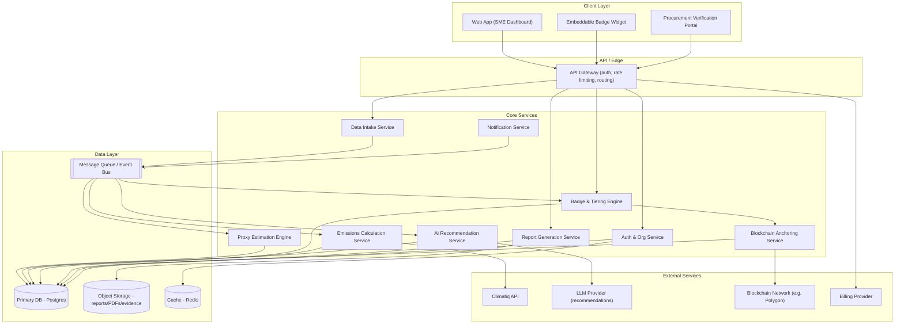

# Cstep — System Architecture

## 1. Overview

Cstep is a digital ESG verification platform that lets SMEs measure, verify, and showcase their carbon footprint in minutes. It combines:

- **Proxy-based emissions estimation** — fast footprint estimates from indirect business data (spend, headcount, revenue, sector) when primary activity data isn't available.
- **Climatiq-powered calculations** — precise emissions factors and calculation logic via the Climatiq API once activity data is provided.
- **AI-powered recommendations** — an LLM-driven advisory layer that turns emissions results into concrete, prioritized reduction actions.
- **Tiered badges** — a scoring/verification-level system (e.g. Bronze/Silver/Gold or Estimated/Verified/Audited) that SMEs can display to buyers and procurement teams.
- **Blockchain-anchored verification** — cryptographic proof-of-integrity for footprint reports, so a badge can be independently verified as unaltered and time-stamped.

This document describes the target system architecture: components, data flow, tech stack, data model, and key cross-cutting concerns (security, scalability, compliance). The repository is currently at the initial-README stage, so this is a proposed architecture to guide implementation, not a description of existing code.

## 2. Goals & Non-Goals

**Goals**
- Let an SME go from sign-up to a shareable, badge-backed carbon footprint report in minutes.
- Support two data-input modes: quick proxy-based estimate, and detailed activity-data calculation via Climatiq.
- Make every issued badge independently verifiable (procurement teams shouldn't have to "trust" Cstep — they can check the anchor).
- Keep the core loop (estimate → recommend → verify → badge) modular so each piece (data source, AI provider, chain) can be swapped later.

**Non-goals (v1)**
- Full external financial/carbon audit (Cstep produces verifiable *reports*, not a substitute for third-party assurance/attestation where legally required).
- Real-time IoT/metered emissions ingestion (can be a future data source behind the same ingestion interface).

## 3. High-Level Architecture

## 4. Component Breakdown

### 4.1 Client Layer
- **Web App (SME Dashboard):** onboarding, org/facility setup, data entry (proxy or detailed), results dashboard, recommendations, badge management, report download/share.
- **Embeddable Badge Widget:** a small JS snippet/iframe SMEs put on their own site or procurement profile, showing live badge status pulled from the API.
- **Procurement Verification Portal:** public, no-login page where a buyer pastes a badge ID or scans a QR code to see the verified report and the on-chain anchor proof.

### 4.2 API Gateway
- Single entry point for all client traffic: authentication, authorization, rate limiting, request routing, and API versioning.
- Terminates TLS, applies per-org rate limits (important since Climatiq and LLM calls cost money per request).

### 4.3 Auth & Org Service
- Handles user accounts, organizations (multi-tenant: one SME = one org, with multiple users/roles), SSO (optional, for enterprise buyers using the verification portal internally), and API keys for widget/portal integrations.
- Role model: `Org Admin`, `Contributor` (data entry), `Viewer`.

### 4.4 Data Intake Service
- Normalizes incoming data regardless of source: manual form entry, CSV/spreadsheet upload, or (future) integration connectors (accounting software, utility bills).
- Validates and routes each submission to either the Proxy Estimation Engine or the Calculation Service, depending on completeness of the data (spend-based proxy vs. activity-based Climatiq calculation).
- Publishes an `IntakeCompleted` event onto the queue rather than calling downstream services synchronously, so calculation, AI, and badge issuance can scale/retry independently.

### 4.5 Proxy Estimation Engine
- Used when an SME only has coarse data (revenue, employee count, sector, spend by category).
- Applies published emission-intensity factors (e.g. spend-based EEIO factors) to produce a fast, clearly-labeled *estimate* rather than a precise calculation.
- Every proxy-derived result is flagged in the data model as `confidence: estimated`, which feeds directly into which badge tier is achievable (estimates alone should cap out at a lower tier than a Climatiq-calculated report).

### 4.6 Emissions Calculation Service
- Used when the SME supplies structured activity data (fuel volumes, electricity kWh, travel distances, purchased goods categories, etc.).
- Calls the **Climatiq API** for emissions factors and calculation logic across Scope 1/2/3 categories.
- Owns retry/backoff and caching of Climatiq responses (factor lookups don't change often — cache aggressively in Redis to control API spend).
- Persists calculation inputs, the Climatiq factor version/ID used, and the output, so a report can be reproduced or re-verified later even if factors update upstream.

### 4.7 AI Recommendation Service
- Takes the finalized emissions breakdown (by scope/category) and generates prioritized, plain-language reduction recommendations (e.g. "Switch delivery fleet to..." "Renegotiate energy supplier for green tariff...").
- Calls an LLM provider with a structured prompt containing the org's emissions profile, sector, and size — never raw uploaded documents, to limit what's sent externally.
- Recommendations are stored and versioned per report, not regenerated silently, so an SME's action plan doesn't change underneath them between logins.

### 4.8 Badge & Tiering Engine
- Central rules engine that decides which badge tier an org qualifies for, based on: data source (proxy vs. Climatiq-calculated), completeness of Scope 1/2/3 coverage, whether third-party evidence was attached, and recency of the report.
- Example tiers: `Estimated` (proxy-only) → `Calculated` (Climatiq, self-reported activity data) → `Verified` (Climatiq + supporting evidence/documents reviewed) → `Anchored & Verified` (all of the above plus blockchain anchor).
- Tier logic is kept as explicit, testable rules (not hardcoded in the UI) so tiers can evolve without redeploying the frontend.

### 4.9 Blockchain Anchoring Service
- Once a report is finalized, this service computes a cryptographic hash of the immutable report payload (emissions results, methodology version, factor versions, timestamp) and anchors that hash on a public chain (e.g. Polygon, chosen for low transaction cost) via a smart contract or a timestamping service.
- Cstep does **not** put any raw business data on-chain — only the hash and minimal metadata (org ID, report ID, timestamp), so anchoring is privacy-preserving.
- Stores the transaction ID/anchor proof alongside the report so the verification portal can recompute the hash from the stored report and compare it against the on-chain record, giving buyers independent, tamper-evident proof.

### 4.10 Report Generation Service
- Renders the finalized footprint report and badge certificate as a shareable PDF/web page, pulling from calculation results, AI recommendations, and the badge/anchor status.
- Stores generated artifacts in object storage, referenced by a stable, public badge URL/QR code.

### 4.11 Notification Service
- Event-driven emails/in-app notifications: report ready, badge tier changed, factor/methodology updates that might affect an existing report, renewal reminders.

## 5. Data Flow (Happy Path)

1. SME signs up, creates an org profile (sector, size, country).
2. SME enters data via the intake flow — either quick proxy inputs or detailed activity data.
3. Intake Service validates and emits an event; Proxy Engine or Calculation Service (via Climatiq) processes it asynchronously.
4. Once emissions results are ready, the AI Recommendation Service generates an action plan.
5. The Badge & Tiering Engine evaluates the completed report against tier rules and assigns a badge.
6. The Blockchain Anchoring Service hashes and anchors the finalized report.
7. The Report Generation Service produces the shareable report/certificate and badge widget data.
8. The SME shares their badge URL/widget; a procurement team opens the Verification Portal, which recomputes the hash and checks it against the on-chain anchor to confirm authenticity.

## 6. Suggested Tech Stack

| Layer | Suggestion | Notes |
|---|---|---|
| Frontend | Next.js (React) + TypeScript | SSR helps the public verification/badge pages load fast and be SEO/crawlable for procurement teams. |
| API | Node.js (NestJS) or Python (FastAPI) | Either fits well; FastAPI is a natural fit if the AI/estimation logic is Python-heavy (data science ecosystem). |
| Queue/Events | Redis Streams or AWS SQS/SNS | Decouples intake from calculation/AI/badge/anchor stages. |
| Primary DB | PostgreSQL | Strong fit for relational org/report/tier data; JSONB columns for flexible emissions line-items. |
| Cache | Redis | Climatiq factor caching, session/auth caching, rate limiting. |
| Object storage | S3-compatible bucket | Generated reports, uploaded evidence documents. |
| AI provider | Claude via Anthropic API | Recommendation generation with structured JSON output. |
| Emissions data | Climatiq API | Activity-based calculations across Scope 1/2/3. |
| Blockchain | Polygon (or similar low-fee EVM chain) | Hash-anchoring only, not raw data storage. |
| Infra | Docker + Kubernetes (or a managed PaaS for v1) | Start on a managed platform (e.g. Render/Fly.io/ECS) and move to k8s once scale justifies the ops overhead. |
| Observability | OpenTelemetry + a hosted APM (e.g. Grafana Cloud/Datadog) | Especially important for tracking external API cost/latency (Climatiq, LLM, chain). |

## 7. Core Data Model (high level)

- **Organization** — id, name, sector, country, size band, subscription tier.
- **User** — id, org_id, role, auth identity.
- **DataSubmission** — id, org_id, type (`proxy` | `activity`), raw payload, status.
- **EmissionsResult** — id, submission_id, scope breakdown, total tCO2e, methodology (`proxy` | `climatiq`), climatiq_factor_version, confidence level.
- **Recommendation** — id, emissions_result_id, text, category, estimated_impact, priority.
- **Report** — id, org_id, emissions_result_id, recommendations_snapshot, generated_at, immutable_payload_hash.
- **Badge** — id, org_id, report_id, tier, issued_at, expires_at.
- **Anchor** — id, report_id, chain, tx_hash, block_timestamp, payload_hash.

## 8. Security & Compliance Considerations

- **Data minimization on-chain:** only hashes and non-sensitive metadata are ever anchored; no business-confidential data touches the public chain.
- **Tenant isolation:** every query scoped by org_id; row-level security enforced at the DB layer, not just the API layer.
- **Auditability:** methodology version and Climatiq factor version are stored per report so a report's numbers can always be explained/reproduced later, even after factors update.
- **AI data boundaries:** only structured, already-anonymized-of-PII emissions figures are sent to the LLM provider — never raw uploaded documents or personal data.
- **Secrets:** Climatiq, LLM, and blockchain provider keys stored in a secrets manager (not env files in the repo), rotated regularly.

## 9. Scalability Notes

- Calculation, AI, and anchoring are all async, queue-driven — a burst of SME sign-ups doesn't block on external API latency.
- Climatiq factor responses are cacheable and change infrequently — cache-first design significantly cuts external API cost as usage grows.
- Blockchain anchoring can be batched (e.g. anchor a Merkle root of many reports per time window instead of one transaction per report) if per-report gas cost becomes a concern at scale.

## 10. Open Questions / Future Considerations

- Which blockchain network best balances cost, permanence, and buyer trust/familiarity (public EVM chain vs. a permissioned ledger)?
- Should evidence documents (utility bills, invoices) supporting a "Verified" tier go through human review, an automated document-AI check, or both?
- Direct data connectors (accounting/ERP systems, utility providers) to reduce manual entry and move more SMEs toward the higher, activity-data-based tiers.
